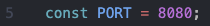

# Space test 1

## Instructions

1. Render the cheapest 5 items on landing sorted by price
2. User should be able to toggle between showing the cheapest 5 items and all items
3. The user should be able to filter an item by name
4. Javascript or Typescript using functional components must be used to implement your solution
5. The answer must be a full github public repo that can be cloned then installed and run by executing 'npm start' or 'yarn start'
6. Add some 3rd party libraries if you feel like they are useful to deliver the requirement, show us your knowledge of the trends in modern development
7. Show us your skills in styling your work, choose a framework or style from scratch, this can make a real difference
8. Please show your knowledge around test driven development by writing tests and showing significant test coverage
9. Pay attention to your naming conventions and patterns you are implementing
10. There is no time limit, we obviously want to see your result as soon as possible but take your time, show us some quality

## Description

I built this App using React, TypeScript, Tailwind CSS, and Shadcn/ui. I'm using Jest and React Testing Library for testing. I also built a simple Express
backend API that generates a list of random products and hosts our API on [http://localhost:8080/api/products](http://localhost:8080/api/products) which is then
fetched on the frontend. Make sure the server is running for the app to work as correctly. See the instructions below to learn how to install and run the app
locally.

## Prerequisites

- Node: `v20.11.1`
- npm: `v10.4.0`

## Installation

Once you've cloned the repository go to the root folder and run:

```
npm install-all
```

this will install dependencies in `/client` and `/server` directories.

Or

```
npm i server-dependencies
```

and

```
npm i client-dependencies
```

to install them separately.

## Start

Once all dependencies are installed run:

```
npm start
```

to start both `client` and `server`.

- client will run on port 3000 - [http://localhost:3000/](http://localhost:3000/)
- server will run on port 8080 - [http://localhost:8080/](http://localhost:8080)

> **NOTE:** Your port 8080 might be already in use. Either stop the process that's running on that port or change the value of `PORT` in line 5 in
> `/server/server.js` file to something else, for example 5000 or 3333.



Or you can start them individually. From the app root folder run:

```
npm run server
```

then open a new tab/window in your terminal and run:

```
npm run client
```
